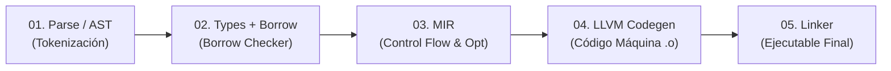

# 📖 Teoría: Sesión 01 - Rust Foundations

---

## 1. ¿Qué es Rust y por qué fue Creado?

**Rust** es un lenguaje de programación de sistemas compilado y tipado estáticamente, iniciado en **2006 por Graydon Hoare** (empleado de Mozilla) y respaldado formalmente en 2009. Su versión 1.0 estable se publicó en mayo de 2015.

### El Origen del Nombre
El nombre proviene de los **hongos de la roya** (*Rust Fungi*), organismos biológicos con una capacidad extrema de resistencia y supervivencia bajo condiciones climáticas hostiles. Graydon se inspiró en esta tenacidad biológica para bautizar un lenguaje concebido para que el software sea robusto, duradero y resistente a fallos críticos de seguridad.

### La Crisis del 70% en la Industria
En software de sistemas escrito en C y C++ (como navegadores web, núcleos de sistemas operativos y bases de datos), aproximadamente el **70% de las vulnerabilidades de seguridad críticas** (según auditorías públicas de Microsoft y Chromium) se deben a **errores en la gestión de memoria**:
- Punteros colgantes (*dangling pointers*).
- Desbordamientos de búfer (*buffer overflows*).
- Uso después de liberación (*use-after-free*).
- Doble liberación de memoria (*double free*).
- Condiciones de carrera (*data races*).

Rust fue diseñado para **eliminar matemáticamente estas clases de errores en tiempo de compilación** sin recurrir a un recolector de basura (*Garbage Collector*).

---

## 2. Los Cuatro Pilares Fundamentales de Rust

| Pilar | Principio | Beneficio Real |
|---|---|---|
| **Speed (Velocidad)** | Compilación a código máquina directo (ELF, PE, Mach-O) mediante el backend de LLVM. Abstracciones de costo cero (*zero-cost abstractions*). | No existen pausas de recolector de basura (*Stop-the-World*), logrando latencias deterministas ideales para motores de juegos, finanzas de alta frecuencia (HFT) y servidores de alto rendimiento. |
| **Concurrency (Concurrencia sin Miedo)** | Verificación estricta de concurrencia mediante el sistema de tipos y los *marker traits* `Send` y `Sync`. | El compilador previene accesos concurrentes no sincronizados a memoria mutable; es imposible compilar código que sufra de *Data Races*. |
| **Safety (Seguridad de Memoria)** | Modelo de *Ownership* (propiedad), *Borrowing* (préstamos) y *Lifetimes* (tiempos de vida) verificados por el *Borrow Checker*. | Garantía estática contra punteros nulos, corrupción de punteros y fugas de memoria típicas sin penalización de rendimiento en ejecución. |
| **Portability (Portabilidad)** | Compilación cruzada (*cross-compilation*) integrada en `rustup` y `cargo`. | Un mismo código puede compilarse para servidores Linux (x86_64, aarch64), Windows, macOS, microcontroladores *bare-metal* (ARM Cortex-M, RISC-V) y navegadores web (WebAssembly / WASM). |

---

## 3. El Trío Nuclear del Ecosistema

```text
┌─────────────────────────────────────────────────────────────┐
│                       ECOSISTEMA RUST                       │
├───────────────────┬───────────────────┬─────────────────────┤
│      rustc        │       Cargo       │      crates.io      │
│  (El Compilador)  │  (El Orquestador) │    (El Registro)    │
│                   │                   │                     │
│  Traduce .rs a    │  Gestor oficial   │  Repositorio común  │
│  código nativo    │  de paquetes,     │  mundial con miles  │
│  vía LLVM y       │  dependencias,    │  de librerías open  │
│  Borrow Checker.  │  tests y build.   │  source auditadas.  │
└───────────────────┴───────────────────┴─────────────────────┘
```

1. **`rustc` (El Compilador Real)**:
   - Es el binario que toma los archivos `.rs` y genera los archivos objeto y ejecutables.
   - Aplica el análisis de tipos, la resolución de nombres, el *Borrow Checker* y delega la generación de código máquina a LLVM.
2. **`Cargo` (El Gestor y Automatizador de Proyectos)**:
   - Resuelve el árbol de dependencias consultando `crates.io`.
   - Descarga, compila y cachea dependencias en paralelo.
   - Invoca a `rustc` con los flags adecuados para desarrollo (`dev`) o producción (`release`).
   - Orquesta la ejecución de tests unitarios y de integración (`cargo test`).
3. **`crates.io` (El Registro Oficial de la Comunidad)**:
   - Registro público donde los desarrolladores publican librerías (*crates*).
   - Integrado de forma transparente mediante la sintaxis de dependencias en `Cargo.toml`.

---

## 4. El Pipeline de Compilación de Rust

FerrisKey incluye un visualizador interactivo animado de las **5 etapas de compilación**:



1. **01 · PARSE / AST (Abstract Syntax Tree)**:
   - `rustc` lee el código fuente en texto plano, lo convierte en una secuencia de tokens léxicos y construye el árbol de sintaxis abstracta (AST).
   - Valida la sintaxis del lenguaje y expande las macros (`println!`, `vec!`, macros procedimentales).
2. **02 · TYPES + BORROW (Verificación Semántica)**:
   - El compilador transforma el AST en **HIR** (High-Level Intermediate Representation).
   - Realiza la inferencia de tipos, comprobación de traits (*trait resolution*) y ejecuta el **Borrow Checker**, asegurando que cada dato tenga un único dueño y que las referencias no superen el tiempo de vida de los datos referenciados.
3. **03 · MIR (Mid-Level Intermediate Representation)**:
   - El código se reduce a un grafo de flujo de control estructurado (bloques básicos e instrucciones elementales).
   - En este punto se realiza la monomorfización de funciones genéricas (creando copias especializadas a costo cero) y optimizaciones intermedias independientes de la arquitectura de la CPU.
4. **04 · LLVM CODEGEN**:
   - `rustc` traduce el MIR a **LLVM IR** (código intermedio de LLVM).
   - El motor LLVM ejecuta sus pipelines de optimización avanzados (vectorización SIMD, desenrollado de bucles, inlining de funciones) y genera código máquina nativo empaquetado en archivos objeto (`.o` / `.obj`).
5. **05 · LINKER (Enlazado)**:
   - El enlazador del sistema operativo combina los archivos objeto de tu proyecto, las dependencias precompiladas de `target/debug/deps` o `target/release/deps` y la librería estándar (`libstd` o libc).
   - Produce el binario ejecutable final listo para la CPU (formato ELF en Linux, PE/COFF `.exe` en Windows o Mach-O en macOS).

---

## 5. Anatomía de un Proyecto Cargo

Un paquete estándar de Cargo se organiza siguiendo convenciones estrictas:

```text
mi_proyecto/
├── Cargo.toml          # Manifiesto del proyecto (metadatos y dependencias)
├── Cargo.lock          # Árbol determinista con hashes y versiones exactas
├── src/
│   ├── main.rs         # Punto de entrada para binario (fn main)
│   ├── lib.rs          # Punto de entrada para librería compartible
│   └── bin/            # Binarios adicionales (ej: src/bin/herramienta.rs)
├── tests/              # Tests de integración externos
│   └── integracion.rs
├── examples/           # Ejemplos prácticos ejecutables
│   └── demo.rs
├── benches/            # Pruebas de rendimiento (benchmarks)
├── build.rs            # Script opcional de precompilación
└── target/             # Artefactos generados por el compilador
    ├── debug/          # Binarios sin optimizar con símbolos DWARF
    ├── release/        # Binarios de producción altamente optimizados
    └── incremental/    # Caché para compilación incremental rápida
```

### Binario vs. Librería
- **Crate Binaria (`src/main.rs`)**: Diseñada para ejecutarse directamente. Requiere una función de entrada `fn main()`. Se genera con:
  ```bash
  cargo new mi_programa
  ```
- **Crate Librería (`src/lib.rs`)**: Diseñada para exportar tipos, funciones, structs y traits reutilizables por otros proyectos. No posee `fn main()`. Se genera con:
  ```bash
  cargo new mi_libreria --lib
  ```
- *Nota*: Un paquete puede combinar ambas modalidades; puede contener una librería en `src/lib.rs` y múltiples ejecutables en `src/bin/*.rs`.

---

## 6. Anatomía de `Cargo.toml` y Semantic Versioning

El archivo `Cargo.toml` utiliza la sintaxis TOML (Tom's Obvious Minimal Language):

```toml
[package]
name = "servidor_web"
version = "0.1.0"
edition = "2024"
rust-version = "1.85"
description = "Servidor HTTP de alto rendimiento"
license = "MIT OR Apache-2.0"
repository = "https://github.com/usuario/servidor_web"

[dependencies]
serde = { version = "1.0", features = ["derive"] }
tokio = { version = "1", features = ["full"] }
rand = "0.8"
```

### Reglas de Versiones Semánticas (SemVer `MAJOR.MINOR.PATCH`)
- `version = "1.2.3"` en Cargo equivale por defecto a `^1.2.3` (permite actualizaciones compatibles que no rompan la API, es decir, `>= 1.2.3, < 2.0.0`).
- Si la versión es `0.x.y`, cualquier incremento en `x` se considera un cambio que rompe la compatibilidad (*breaking change*).

---

## 7. Perfiles de Compilación y Tiempos de Compilación

Cargo define dos perfiles predeterminados principales:

| Característica | Perfil `dev` (`cargo build`) | Perfil `release` (`cargo build --release`) |
|---|---|---|
| **Nivel de Optimización (`opt-level`)** | `0` (Sin optimizar, traduce código 1:1) | `3` (Optimización agresiva de LLVM) |
| **Símbolos de Depuración** | Sí (DWARF completos para GDB/LLDB) | Por defecto ninguno o mínimos (`strip`) |
| **Tiempo de Compilación** | Rápido (ideal para el ciclo de desarrollo) | Lento (el linker y LLVM tardan más) |
| **Velocidad de Ejecución** | Lenta (sin inlining ni vectorización) | Máximo rendimiento nativo |
| **Chequeos de Desbordamiento** | Sí (hace `panic!` si un entero se desborda) | No (hace *two's complement wrap*) |
| **Ubicación del Binario** | `target/debug/<nombre>` | `target/release/<nombre>` |

### Ajuste Fino en `Cargo.toml` para Producción
```toml
[profile.release]
opt-level = 3          # Máxima optimización de código máquina
lto = "thin"           # Link-Time Optimization entre crates independientes
codegen-units = 1      # Permite a LLVM optimizar el proyecto como un único bloque
strip = "symbols"      # Elimina nombres de funciones y símbolos, reduciendo el binario
```

---

## 8. Herramientas Satélite Oficiales

1. **`Clippy` (`cargo clippy`)**:
   - Linter oficial con más de 650 reglas clasificadas por corrección, estilo, complejidad y rendimiento.
   - Sugiere construcciones idiomáticas (ejemplo: reemplazar `.iter().map().collect()` por `.copied()` o evitar clones innecesarios).
2. **`Rustfmt` (`cargo fmt`)**:
   - Formateador automático que estandariza sangrías, saltos de línea y longitud máxima de líneas según las directrices comunitarias.
3. **`Rust-Analyzer`**:
   - Implementación del protocolo LSP (*Language Server Protocol*) que alimenta a VS Code, Zed, Neovim y Helix con análisis semántico, autocompletado inteligente y navegación a la definición en tiempo real.
4. **`Rustup`**:
   - Instalador y gestor de toolchains. Permite alternar entre canales (`stable`, `beta`, `nightly`) y añadir objetivos de compilación cruzada:
     ```bash
     rustup target add wasm32-unknown-unknown
     ```
